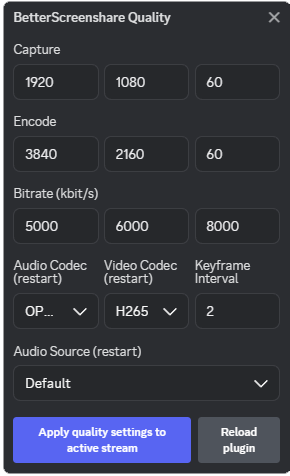

# Important Notice

**This project has been moved from BetterDiscord to Vencord.** Please visit the new repository:

[Vencord Repository](https://github.com/philhk/Vencord)

# Better Discord Screenshare Plugin

With this plugin you can customize your resolution, framerate, bitrate and more for your screenshare on discord! This plugin requires an [installation](https://github.com/BetterDiscord/BetterDiscord#manual-installation 'installation') of the [BetterDiscord](https://github.com/BetterDiscord/BetterDiscord 'BetterDiscord') client.

<div align='center'>
  
</div>

## Plugin

To get the plugin, you can either build it yourself by cloning this repository or download the latest version from the Releases tab.

## Features

- **Capture** - Set a custom capture resolution and framerate.
- **Encode** - Set a custom encode resolution and framerate.
- **Bitrate** - Set a custom min, target and max bitrate.
- **Keyframe Interval** - Set a custom keyframe interval.
- **Audio Source** - Set a custom audio source even when sharing a screen. Takes effect the next time you go live (see Known Issues below - it cannot be changed while already streaming).
- **Codec** - Set a custom video and audio codec [OPUS, H264, VP8, VP9, AV1].
- **Floating settings popout** - A draggable gear button appears on screen while this plugin is active, giving you quick access to every setting above without opening Discord's settings.
- **Apply quality settings to active stream** - Pushes your current resolution/bitrate/codec/keyframe settings to an already-live stream immediately, instead of only taking effect on your next "Go Live". Discord doesn't reliably reapply these on its own when you switch what you're sharing mid-stream, so this button re-asserts them. Does not touch audio source - see Known Issues.
- **Reload plugin** - A shortcut for disabling and re-enabling the plugin from BetterDiscord's plugin list, without leaving the settings panel. See Known Issues for why you'd want this.

## Default Config

```
{
  bitrate: {
    minimum: 1000,
    target: 2500,
    maximum: 5000,
  },
  encode: {
    framerate: 60,
    height: 1080,
    width: 1920,
  },
  capture: {
    framerate: 60,
    height: 1080,
    width: 1920,
  },
  audioCodec: 'OPUS',
  videoCodec: 'H264',
}
```

## Known Issues

Quality settings are configured through this plugin's own settings panel (BetterDiscord Settings → Plugins → the gear icon next to BetterScreenshare, or the floating popout while live) and are applied automatically when you go live.

**Your own local stream preview can go black.** This happens after this plugin pushes a resolution/framerate change to an already-live connection (either automatically, when Discord resets your stream's quality on its own - e.g. after you switch what you're sharing mid-stream - and this plugin re-asserts it, or when you click "Apply quality settings to active stream"). It's cosmetic only: viewers always continue to see the correct stream at the correct quality the entire time, this only affects the thumbnail/fullscreen preview on your own screen. It's also inconsistent - sometimes switching to a different screen/window and back recovers it, sometimes it doesn't, and the plugin's default startup state (loaded from Discord launch) tends to be the least reliable one to recover from. This looks like a race condition in Discord's own native capture session reinitialization, not something this plugin can reliably control or predict.

The most reliable state we've found is having the plugin **reloaded while you're already streaming**, rather than continuously loaded from Discord startup. If your preview goes black, use the "Reload plugin" button in the settings panel (or manually disable and re-enable the plugin in BetterDiscord's plugin list) while your stream is live - this doesn't interrupt the stream itself, only briefly reinitializes the plugin.

**Audio source cannot be changed while already streaming.** Confirmed live that calling Discord's soundshare-attach API again on an already-attached connection breaks audio - even calling it again with the exact same source is enough to silently kill it, and Discord doesn't report this as a failure on its own. Because of this, changing "Audio Source" only takes effect the next time you start a stream; this plugin deliberately does not try to apply it live (including via the Apply button), since doing so reliably corrupts a working stream's audio instead of switching it.

## Scripts

- `build` Build the plugin.
- `watch` Build the plugin when a change was made.

## Credits

- [Zerthox](https://github.com/Zerthox) for BetterDiscord's API [typings](https://github.com/Zerthox/betterdiscord-types), [Dium](https://github.com/Zerthox/BetterDiscord-Plugins/tree/master/packages/dium) and his huge amount of help.
